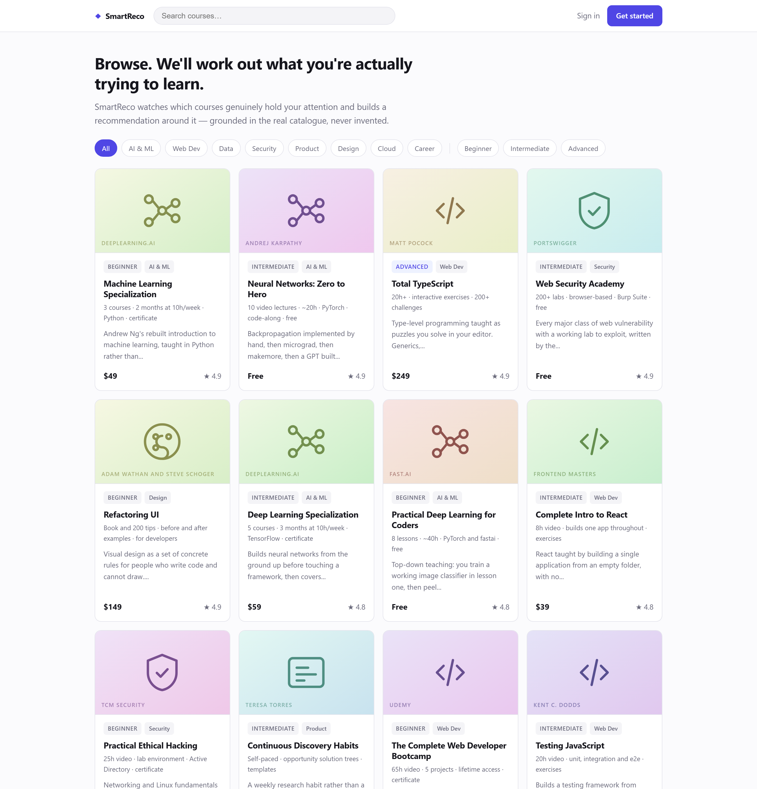
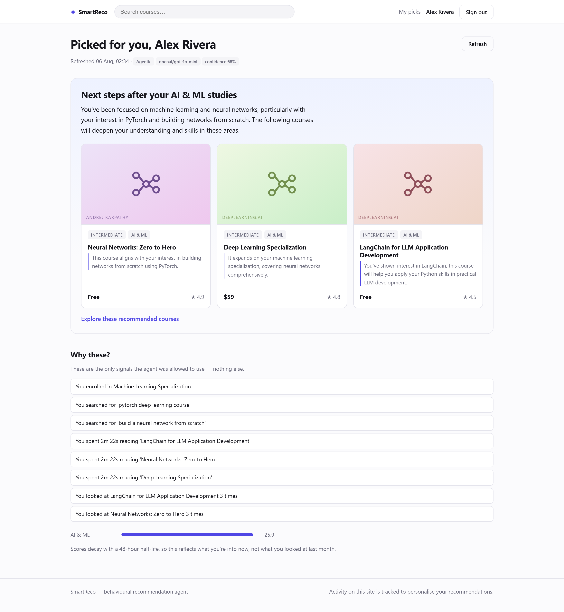
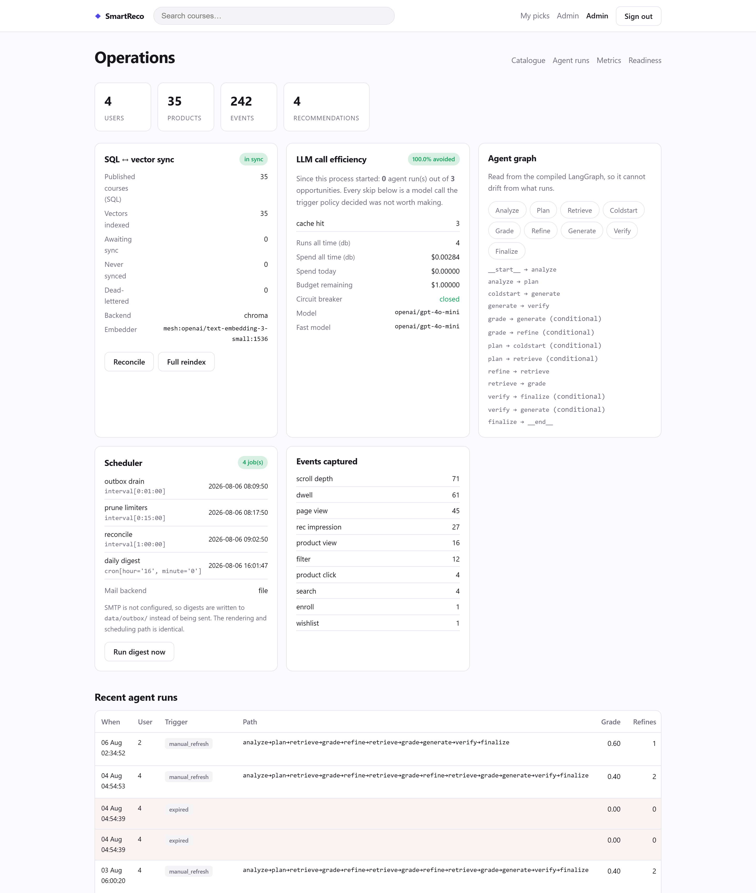

# SmartReco

**A behavioural AI recommendation agent for an online learning platform.**

It watches  how each learner actually behaves, reasons over that behaviour with a
LangGraph agent, retrieves matching courses from a vector database, and writes a
persuasive recommendation that is *grounded in the real catalogue* and *checked for
honesty* before anyone sees it.

```
┌──────────────────────────────── BROWSER ─────────────────────────────────────┐
│ Jinja2 pages · tracker.js → throttle → batch(20 | 5s) → sendBeacon ──┐       │
└──────────────────────────────────────────────────────────────────────┼───────┘
                                                          202 in ~10ms │
┌──────────────────────────── FastAPI ─────────────────────────────────▼───────┐
│                                                                              │
│  ┌── INGEST ─────────┐   ┌── TRIGGER POLICY ────┐   ┌── AGENT (LangGraph) ─┐ │
│  │ bounded queue     │──▶│ enough events?       │──▶│ analyze → plan →     │ │
│  │ dedupe by idem key│   │ cooldown elapsed?    │   │ retrieve → grade →   │ │
│  │ chunked bulk write│   │ interests drifted?   │   │  (refine ⟲ ≤2) →     │ │
│  └────────┬──────────┘   │ budget left?         │   │ generate → verify →  │ │
│           │              │ signature cached? ─skip│  │ finalize             │ │
│           ▼              └──────────────────────┘   └──────┬───────────────┘ │
│  ┌── PROFILE ────────┐                                     │                 │
│  │ 48h half-life     │      ┌── RETRIEVAL ──────────────┐  │                 │
│  │ intent weighting  │─────▶│ vector kNN ⊕ BM25         │◀─┘                 │
│  │ interest centroid │      │ → RRF → filter → MMR      │                    │
│  └───────────────────┘      └───────────────────────────┘                    │
│  ┌── OUTBOX WORKER ──┐   ┌── APScheduler ────────────────────────────────┐   │
│  │ drain · backoff   │   │ 16:00 digest · 60s outbox · 1h reconcile      │   │
│  └────────┬──────────┘   └───────────────────────────────────────────────┘   │
└───────────┼──────────────────────┬────────────────┬──────────────┬───────────┘
            ▼                      ▼                ▼              ▼
     ┌─────────────┐      ┌──────────────┐   ┌────────────┐  ┌───────────┐
     │ SQLite / PG │      │   Mesh API   │   │  ChromaDB  │  │   SMTP    │
     │  10 tables  │      │ chat + embed │   │ / Pinecone │  │ / file    │
     └─────────────┘      └──────────────┘   └────────────┘  └───────────┘
```

---

## Key features

**Behaviour capture that cannot slow the page down**
- Twelve signal types: `page_view` · `product_view` · `product_click` · `search` · `search_result_click` · `filter` · `scroll_depth` (25/50/75/100) · `dwell` · `wishlist` · `enroll` · `rec_impression` · `rec_click` — a click *from search results* is a different, higher-intent event than a click from a browse tile, and is weighted accordingly
- Batched at 20 events or 5 s; scroll throttled, search debounced; `sendBeacon` on unload so the final dwell is never lost
- **p50 3.0 ms** for a page's worth of events — less than rendering the page itself
- `localStorage` spill-over retries through 429s and 5xx; every event carries an idempotency key

**A catalogue that cannot silently diverge**
- **Transactional outbox**: the row and its sync intent commit together, so an outage is a delay, not divergence
- Hourly `reconcile()` diffs SQL against the index by content hash and repairs `missing`, `stale` and `orphaned` drift — all three verified live on **both** vector backends
- Unpublishing enqueues a delete, so the index holds *exactly* the published courses

**An agent that reasons, not a template**
- **LangGraph**: 9 nodes and 3 branch points (6 conditional edges), a bounded refine loop (≤2) and a repair loop (×1)
- Hybrid retrieval — vector kNN ⊕ BM25 → **RRF** → metadata filters → **MMR** → LLM re-rank
- **recall@1 0.95 · recall@5 1.00 · MRR 0.975** over 20 paraphrase probes
- **Groundedness verifier**: a recommended id that was never offered is dropped and the draft repaired

**Copy that is persuasive *and* checkable**
- Cites only `evidence()` — concrete facts about what the learner actually did, shown to them as "Why these?"
- **35 deterministic checks** — 31 regex rails plus discount, catalogue-price, PII and length cross-checks — block job guarantees, invented statistics, fake scarcity and prices that aren't in the catalogue. Always on, free, offline, in CI
- Returns **fewer** than `REC_TOP_K` rather than padding with a filler

**Spending that is deliberate**
- **11 trigger gates**, cheapest-first, each recording why it skipped
- Cache keyed on the *ranked order* of interests, not raw scores — scores drift on every event, order does not
- Daily USD budget, per-user daily cap, circuit breaker, embedding cache (re-seeding costs **$0**)

**Operable**
- **LangSmith** traces the graph with Mesh calls nested as real `llm` runs; **Logfire** traces the request around it; one run reaches both through LangSmith's OTel bridge — all verified against live projects
- `/admin` shows sync health, LLM calls avoided and why, the compiled graph, and every run's node path, tokens, cost and latency
- APScheduler daily digest, idempotent per `digest:<user>:<date>`
- **314 tests**, 90% coverage, hermetic and free — `LLM_ENABLED=false` runs everything offline

---

## What it looks like

**The catalogue** — 35 real courses, filterable by track and level. Artwork is generated
per slug, so there are no third-party image requests and nothing reads as a missing asset.



**A recommendation**, written by the agent for one learner from that learner's behaviour.
The *"Why these?"* panel underneath is the part that matters: it lists **the only signals
the agent was allowed to cite** — the enrolment, the two searches, the dwell times, the
repeat views. Every claim in the prose above is checkable against that list.

Two details worth looking for: the header reads `agentic · openai/gpt-4o-mini ·
confidence 68%`, and *Machine Learning Specialization* — the course they already enrolled
in — is **not** recommended back to them.



**Operations** — SQL↔vector sync health, the trigger policy's skip reasons with a live
"100% avoided" ratio, the agent graph **read from the compiled LangGraph object** so it
cannot drift from what actually runs, the scheduler's next fire times, and every run's
node path, grade and refine count. Those
`analyze→plan→retrieve→grade→refine→retrieve→grade→…` rows are real refine loops.



---

## Quickstart

```bash
git clone <your-fork> && cd SmartReco
cp .env.example .env          # add your MESHAPI_API_KEY (starts with rsk_)
make install
make seed
make run                      # http://localhost:8000
```

**Windows without `make`** (PowerShell/cmd, e.g. plain VS Code terminal — `make` isn't
a native Windows command): every target is a one-line `uv` call, so run them directly.

```
uv sync --all-extras
uv run python -m app.seed
uv run uvicorn app.main:app --reload --port 8000    # http://localhost:8000
```

| Sign in as | Email | Password |
|---|---|---|
| admin | `admin@smartreco.dev` | `admin12345` |
| learner | `learner@smartreco.dev` | `learner12345` |

**It also runs with no API key at all.** Set `LLM_ENABLED=false` and the app uses a
deterministic embedder and template-based copy — every feature works, nothing is
mocked out, and it spends nothing. That's the mode the whole test suite runs in.

### See it work

1. Browse a few machine-learning courses, search for something, scroll, sit on a course
   page for a minute.
2. Open **`/me`** — the agent reads that behaviour and writes a recommendation.
   The *"Why these?"* panel lists the only facts it was allowed to cite.
3. Open **`/admin`** — SQL↔vector sync health, LLM calls avoided and why, the compiled
   agent graph, and every run with its node path, tokens, cost and latency.
4. Press **"Run digest now"** — the daily email renders to `data/outbox/*.html`.

The catalogue is 35 real courses across AI/ML, web dev, data, cloud, security, design,
product and career — from Andrew Ng's specialisations to Karpathy's Zero to Hero to
OSCP. Deliberately recognisable, so you can judge for yourself whether a recommendation
makes sense instead of taking it on trust.

---

## How each requirement is met

### 1. Platform

Email/password auth (bcrypt cost 12, JWT in an `HttpOnly` cookie, CSRF double-submit),
two roles, and **10 tables** — nine related, plus a standalone embedding cache:

```
users ─┬─1:1─ user_profiles
       ├─1:N─ events ──N:1─ products ─1:N─ vector_outbox
       ├─1:N─ recommendations ─1:N─ recommendation_items ─N:1─ products
       ├─1:N─ agent_runs
       └─1:N─ notifications

embedding_cache          keyed by (embedder, text), joined to nothing on purpose
```

`embedding_cache` deliberately has no foreign key: vectors are a pure function of the
model and the text, so a re-seed reuses what was already paid for even when the row that
first needed them is gone.

### 2. Catalogue management with dual-write

Admin CRUD at `/admin/products`. The write is **not** a best-effort double write — it
is a **transactional outbox**:

1. Saving a course writes the `products` row **and** a `vector_outbox` row in **one
   commit**. Atomic.
2. A worker drains the outbox: embed → upsert → stamp `vector_synced_at`.
3. Failures retry with exponential backoff + jitter, then dead-letter after 5 attempts.
4. An hourly `reconcile()` diffs SQL against the index **by content hash** and repairs
   drift in both directions.

A naive `db.commit(); chroma.upsert()` has a window where SQL committed and the vector
write failed, and **nothing remembers it needs fixing**. Here the *intent to sync* is
committed with the data, so an outage is a delay rather than permanent divergence.

Three drift classes are tested by injecting each fault — **on both backends, live**:

| Injected | Detected | Repaired |
|---|---|---|
| Vector deleted, SQL still has it | `missing` | ✅ |
| Ghost vector with no SQL row | `orphaned` | ✅ |
| Vector's `content_hash` tampered | `stale` | ✅ |

**The invariant:** the index contains *exactly* the published courses. Unpublishing
enqueues a delete rather than setting a flag retrieval must remember to filter on.

### 3. Behavioural event tracking

`tracker.js` — ~290 lines, no dependencies. Captures `page_view`, `product_view`,
`product_click`, `search`, `search_result_click`, `filter`, `scroll_depth`
(25/50/75/100), `dwell`, `wishlist`, `enroll`, `rec_impression`, `rec_click`.

**Non-blocking by construction:**

- Batches at **20 events or 5 s**, whichever comes first
- Scroll throttled to 1/500 ms; search debounced 400 ms and ignored below 3 characters
- `navigator.sendBeacon` on `pagehide`/`visibilitychange` — the browser completes it
  after the page is gone, which is exactly when dwell time is finally known
- `requestIdleCallback(fn, {timeout: 500})` — the timeout is mandatory, a backgrounded
  tab defers an untimed callback indefinitely
- `localStorage` spill-over retries a failed batch on the next page load, **including
  when the server answered 429 or 500** — `fetch` resolves on those, so a `.catch()`-only
  handler drops exactly the batches worth keeping
- Flushes are chunked to the server's per-batch cap, so a stash drain after an outage
  cannot arrive as one oversized 422
- Every event carries a client-generated idempotency key, so retries are free

**Measured against the running server** (25 requests per row, end to end):

| batch | p50 | p95 | max |
|---|---|---|---|
| 1 event | 2.7 ms | 4.1 ms | 6.4 ms |
| 10 events (one page's worth) | 3.0 ms | 4.4 ms | 21.2 ms |
| a course page render, for scale | 5.5 ms | 13.6 ms | — |

The beacon costs less than rendering the page it is reporting on. Three identical
replays → `persisted: 6, duplicates: 2` from a batch of 8.

The server validates **per event**, not per batch — a retired event type from a
`tracker.js` still in someone's browser cache rejects that one event, not the 99 good
ones alongside it. The rate limiter charges per event and is sized from that: a
25-page session at ~10 events a page never trips it, an 800-event burst does.

### 4. The agentic recommendation engine

Nine LangGraph nodes. **Only two spend tokens.**

```
START → analyze → plan ─┬─▶ coldstart ────────────┐
                        └─▶ retrieve → grade ─┬───┴─▶ generate → verify ─┬─▶ finalize → END
                                ▲             │                          │
                                └── refine ◀──┘ (score < 0.6, max 2)     └─▶ generate (repair ×1)
```

| Node | Model? | Job |
|---|---|---|
| `analyze` | — | profile → search query, metadata filters, citable evidence |
| `plan` | — | enough signal to retrieve against, or cold start? |
| `coldstart` | — | no usable behaviour yet: the catalogue's own top-rated, rather than an invented interest |
| `retrieve` | — | vector ⊕ BM25 → RRF → filter → MMR |
| `grade` | **fast** | LLM-as-judge on retrieval quality **and** re-rank, in one call |
| `refine` | — | reword the query, widen filters, retry |
| `generate` | **main** | persuasive JSON: headline, narrative, per-course reasons |
| `verify` | — | groundedness + honesty gate |
| `finalize` | — | fall back to honest copy rather than ship something wrong |

**`analyze` is deliberately deterministic.** Turning a behaviour profile into a search
query is arithmetic over scores already computed — paying a model to restate its own
inputs adds latency, cost and a failure mode for no accuracy gain. The nodes that need
*judgement* get a model.

**`verify` is the anti-hallucination gate.** Two independent failure modes, both tested:

- A recommended `product_id` that was never offered → **dropped**, repair triggered
- Copy that is grounded but *dishonest* → **caught by guardrails**

Repair is bounded to **one** attempt. An unbounded loop against a model repeating the
same mistake burns budget without converging.

**Level as a progression signal.** Courses carry `beginner | intermediate | advanced`.
A learner consistently opening advanced material has outgrown the introductory shelf, so
retrieval spans their level and the next rung up — which is exactly what someone learning
wants recommended, and what lets the copy say *"this picks up where that left off"*
rather than just *"here's something similar"*.

**Is it actually personalised, or a popular list with better prose?** Three learners,
same catalogue, different histories, run against the live gateway:

| | shared with the popularity baseline | with each other |
|---|---|---|
| beginner, browsed AI/ML, searched *"learn machine learning from scratch"* | 1 / 4 | — |
| advanced, browsed security, searched *"penetration testing certification"* | 1 / 4 | 0 / 4 |
| career-switcher, browsed data, searched *"sql for analysts"* | 0 / 4 | 0 / 4 |

No two learners were shown the same course, and each got material at **their** level —
the beginner got Andrew Ng, the advanced learner got OSCP first. The copy tracks the
behaviour too:

> **You've been exploring data courses, particularly focusing on SQL and analytics. The
> Google Data Analytics Certificate directly aligns with your goal of building a
> portfolio for a career change in data.**

The security learner's run exercised the refine loop **twice** —
`analyze → plan → retrieve → grade → refine → retrieve → grade → refine → retrieve →
grade → generate → verify → finalize`, $0.000691. The career-switcher was shown **two**
courses, not four: only two genuinely fit, so the agent stopped.

### 5. Efficiency and production thinking

A recommendation costs a model call only if **every** gate passes:

```
events_since_last_rec ≥ 5
  AND now − last_rec ≥ 90s
  AND ( cosine drift ≥ 0.10  OR  ≥15 new events  OR  expired  OR  user pressed refresh )
  AND daily budget not exhausted  AND  per-user cap not hit  AND  circuit closed
  AND behaviour signature not already cached
```

The **behaviour signature** is the cache key: `sha256` of the *ranked order* of the top
categories, tags, brands, tier and price band. Ranked order, not raw scores — scores
move on every single event, so a score-based key would never hit.

Every skip records a reason, and `/admin` shows them:

```
cache_hit 41 · interests_unchanged 22 · too_few_new_events 18 · cooldown 9 · warming_up 4
```

Other production concerns: bounded ingest queue that **sheds** rather than growing
under flood; embedding cache keyed by content hash (re-seeding costs $0); circuit
breaker; per-model runtime parameter negotiation; structured JSON logs with a request
id threaded through to the agent; Prometheus `/metrics`; `/healthz` + `/readyz`;
token-bucket rate limiting; CSP and security headers.

---

## Bonus features

| Bonus | Status |
|---|---|
| ⭐ **Structured agent framework** | LangGraph 1.2, 9 nodes, conditional edges, bounded refine + repair loops. `/admin` renders the graph **read from the compiled object**, so it cannot drift from what runs |
| ⭐ **Scheduled proactive delivery** | APScheduler: digest at 16:00 UTC (with jitter), outbox drain 60 s, reconcile hourly. Idempotent via a unique `digest:<user>:<date>` key |
| ⭐ **Observability** | **LangSmith** traces the graph (with the Mesh calls nested inside as real `llm` runs), **Logfire** traces the request around it — HTTP, SQL, tokens — and one run reaches both through LangSmith's OTel bridge. **Both live, not just wired.** Plus a durable `agent_runs` table: node path, grade, refines, tokens, cost, latency, trace URL. [Details ↓](#observability-two-views-one-run) |
| ⭐ **Retrieval polish** | Hybrid vector+BM25 → RRF → metadata filters → MMR → LLM re-rank. Relevance floor **tuned by sweep, not guessed** |
| ➕ **Guardrails** | Deterministic rails always on (free, offline); NeMo Guardrails as an opt-in second layer, routed through Mesh |
| ➕ **Two vector backends** | Chroma locally, Pinecone when deployed, behind one 7-method protocol. **Both verified against live indexes** — identical recall on the same 20 probes, one env var apart |
| ➕ **Offline eval harness** | 20 paraphrase probes, recall@k + MRR, `make eval` |

---

## Design decisions with evidence

### Model selection — measured, not assumed

I probed the live gateway before writing a line of agent code:

| Model | Latency | Completion tokens | Valid JSON? |
|---|---|---|---|
| `moonshotai/kimi-k3` | 12.7 s | 396 (**220 reasoning**) | ✅ best copy |
| `openai/gpt-4o-mini` | 1.8 s | 142 (0 reasoning) | ✅ |
| `google/gemini-2.5-flash` | 5.5 s | 886 (757 reasoning) | ❌ truncated |
| `anthropic/claude-haiku-4.5` | 3.3 s | 181 | ❌ ```json fenced |

Three behaviours in `mesh.py` exist purely because of that probe:

1. **`EmptyCompletion`** — a reasoning model can return **200 OK with `""`** if the
   token ceiling is consumed by hidden reasoning. Default ceiling is 4000 with an
   explicit error instead of a baffling downstream parse failure.
2. **Runtime parameter negotiation** — `kimi-k3` returns 400 on any `temperature != 1`.
   A 400 naming a parameter drops it and *remembers* that per model, rather than a
   hardcoded quirk list that rots.
3. **Fence-tolerant JSON parsing** — models fence JSON *even in `json_object` mode*.

Default is `gpt-4o-mini`; switch `MESHAPI_MODEL` to `kimi-k3` for a demo recording.

### Retrieval floor — swept, not guessed

A kNN index returns *k* results whether or not any are near. With `k=40` over a
35-course catalogue that is nearly everything, so those ranks are noise that dilutes rank
fusion. Sweeping the floor over 20 paraphrase probes (`make sweep`):

| ratio | recall@1 | recall@5 | MRR | avg pool |
|---|---|---|---|---|
| 0.00 | 0.95 | 1.00 | 0.975 | 32.8 |
| 0.35 | 0.95 | 1.00 | 0.975 | 26.0 |
| 0.50 | 0.95 | 1.00 | 0.975 | 13.3 |
| **0.55** | **0.95** | **1.00** | **0.975** | **10.0** |
| 0.60 | 0.95 | 1.00 | 0.975 | 7.5 |
| 0.80 | 0.95 | 1.00 | 0.975 | 1.9 |

Quality is **flat** across the entire range: the fused ranking is already right, so the
floor is not a quality knob here at all — it decides how much noise MMR has to
diversify over. `retrieve` asks for 8 candidates, so `0.55` (pool 10) leaves a real
choice while `0.60` and tighter starves it below what was requested. Tuned on one
catalogue of 35 items — re-run `make sweep` if yours differs.

**The probes needed fixing before the numbers meant anything.** A first draft described
teaching styles with no subject — *"get something working in week one and explain it
afterwards"* — and scored recall@1 **0.50**. Vector-only inspection showed the best hit
at similarity 0.29: a sentence about pedagogy matches every course equally. That was
measuring the probes, not the retrieval. Rewritten to name the subject while still
avoiding the course's title words, recall@1 went to **0.95**.

### RRF fuses by rank, never by score

Cosine lives in `[-1,1]`; BM25 is unbounded and corpus-dependent. Normalising them into
a weighted sum means inventing an exchange rate that shifts with every catalogue edit.
Tested: a vector hit scoring `999999` and a lexical hit scoring `0.0001` produce
**identical** fused scores — both are rank 1.

### Guardrails, because the model is being asked to persuade

Invented discounts and manufactured scarcity are not hypothetical failure modes here —
they are the *most likely* ones, because persuasive training data is full of them. The
deterministic rails block outcome promises, fabricated urgency, invented discounts,
**any price not in the catalogue**, unsupported superlatives, and PII. They run always,
free, offline and in CI.

**Real courses raise a second risk.** A model recognises the Deep Learning
Specialization and will happily recite a syllabus from training data that may be wrong or
years stale. The generation prompt therefore states that catalogue facts are the *only*
facts it may use, and the `spec` field exists so there is always something accurate to
quote.

**Education invites a specific set of inventions.** The catalogue has a title, provider,
track, level, price, rating, tags and a syllabus line — no accreditation, no placement
data, no cohort dates, no completion statistics. So "job guarantee", "93% of graduates
find work", "accredited", "recognised by employers", "seats are filling", "1-on-1
mentoring" are unsupported *by construction*, and every one is a phrase a model reaches
for unprompted, because its training data on course marketing is saturated with them.

The reverse error matters just as much. One syllabus line genuinely says **"lifetime
access"** — a rail on that phrase would reject the model for quoting the catalogue
correctly. The rails forbid only what the catalogue cannot support, never what it does,
and a test pins both directions.

### Recommending fewer than four

Retrieval always returns a full slate, so a narrow interest gets padded with whatever
fused in behind it. An A/B run caught it live on the previous catalogue: a fitness
shopper's fourth pick was a video doorbell, reasoned as *"in case you're looking for more
tech at home"*. Honest, grounded, and exactly what makes a recommender feel generic.

The generation prompt now asks for *up to* `REC_TOP_K` and says plainly that three
courses someone would actually take beats four with a filler. Verified on the current
catalogue: the career-switching learner was shown **two** courses, because only two
genuinely fit a beginner moving into data.

### Observability: two views, one run

Two backends, because they answer different questions and neither is complete alone.
**LangSmith** shows the graph — which node ran, what the model was actually asked, why
`verify` rejected a draft. **Logfire** shows the request that graph was serving — the
HTTP span, the SQL underneath it, the Mesh call and its token count, on one timeline.

They are joined rather than duplicated. Setting `LANGSMITH_TRACING_MODE=hybrid` makes
the LangSmith SDK write each run to LangSmith *and* emit it as an OpenTelemetry span,
which Logfire receives because Logfire owns the global tracer provider. One run, two
places — **both verified live against real projects**, with the LangSmith SDK confirmed
to be writing into `logfire._internal.tracer._ProxyTracer` rather than one of its own.
The whole graph arrives, refine loops, guardrail repair and all:

```
smartreco.recommend                                          $0.000601
  └ LangGraph
     └ analyze → plan → retrieve → grade → generate → verify → finalize
                          ChatOpenAI 673 tok ─┘        └─ 1447 tok
```

Mesh traffic leaves through the raw OpenAI SDK, not a LangChain model, so LangSmith
would otherwise show chain nodes with nothing underneath them — no prompt, no tokens.
`wrap_openai` on the Mesh client fixes that: the three calls in the run above appear as
three `llm` runs totalling 2,747 tokens, which is exactly what `agent_runs` recorded
independently. Logfire gets the same calls through `instrument_openai`.

Two things here fail *silently*, which is why `app/observability.py` is one module and
not two, and why they have tests:

**Ordering.** `langsmith.Client` decides once, at construction, where its OTel spans go:
adopt an existing global provider, or build its own pointed at LangSmith's OTLP endpoint.
Configure Logfire after that and LangGraph spans never reach it — nothing errors, they
just go elsewhere. `configure()` runs Logfire first and only then sets hybrid mode; set
hybrid with no provider installed and every run lands in LangSmith *twice*.

**Sinks.** `LOGFIRE_ENABLED=true` with no token and no console output builds a span per
request and drops all of them — instrumentation overhead buying nothing. That is refused
with a warning naming the fix rather than started. And `send_to_logfire` is pinned to
`"if-token-present"`: the plain `True` makes Logfire open an interactive project setup,
which in a container is a boot that hangs forever.

The same wiring fixed a bug it exists to catch. `AgentRun.langsmith_url` had always
stored `""`: it was read next to the other fields, after the graph returned, where
`get_current_run_tree()` is already `None`. The link is now captured inside the traced
call, and a regression test models exactly that distinction.

`/readyz` reports which backends are live, so "are traces being recorded" is answerable
without reading logs — the question you ask once the demo is already running.

---

## Testing

```bash
make test     # 314 tests, offline, no API key, spends nothing
make cov      # coverage report (90%)
make eval     # retrieval quality against 20 paraphrase probes
```

Without `make` (Windows): `uv run pytest tests/ -q`, add `--cov=app --cov-report=term-missing`
for `cov`, or `uv run python scripts/eval_retrieval.py` for `eval`.

| Module | Covers |
|---|---|
| `test_unit.py` | passwords, JWT, CSRF, JSON extraction, guardrails, BM25, RRF, MMR |
| `test_mesh.py` | Mesh gateway against a stub: retries, breaker, budget, parameter negotiation, the empty-completion trap |
| `test_storage.py` | embedding cache, both vector backends, dual-write, outbox retry + dead-letter, all three drift classes |
| `test_pipeline.py` | ingest, dedupe, decay, evidence, drift, signature, **all 11 trigger gates** |
| `test_agent.py` | graph shape, groundedness verifier, repair bounding, end-to-end |
| `test_digest.py` | audience, rendering, once-only delivery, SMTP send path, scheduler |
| `test_api.py` | HTTP: auth, CSRF, tracking ingest, admin access control, dual-write over HTTP |
| `test_observability.py` | sink selection, the OTel bridge, and the two silent failure modes below |

Several tests are explicitly labelled regressions for bugs found during the build — an
unpublished course staying recommendable, a search-only learner getting no interest
signal, duplicate texts being embedded twice in one batch, error pages returning 200,
and the digest's failure counter reporting a clean run while nothing was delivered.

---

## Configuration

Everything is in `.env` (see `.env.example`). The knobs that matter most:

| Variable | Default | Effect |
|---|---|---|
| `LLM_ENABLED` | `true` | `false` runs the whole app offline for $0 |
| `LLM_DAILY_BUDGET_USD` | `1.00` | Hard spend cap across all callers |
| `REC_MIN_EVENTS` | `5` | Events before a recommendation is considered |
| `REC_COOLDOWN_SECONDS` | `90` | Floor between runs for one learner |
| `REC_DRIFT_THRESHOLD` | `0.10` | Interest change needed to justify a call |
| `RETRIEVAL_SCORE_RATIO` | `0.55` | Relevance floor, relative to the best hit |
| `VECTOR_BACKEND` | `chroma` | `chroma` locally, `pinecone` when deployed — `docker compose` sets it |
| `LANGSMITH_TRACING` | `false` | `true` + an API key traces the graph |
| `LOGFIRE_ENABLED` | `false` | Needs `LOGFIRE_TOKEN` **or** `LOGFIRE_CONSOLE=true` to do anything |
| `MAIL_BACKEND` | `auto` | `auto` picks SMTP if configured, else the file sink |
| `DIGEST_HOUR` | `16` | Daily digest, UTC |

---

## Deployment

```bash
docker compose up --build                      # SQLite on a volume
docker compose --profile postgres up --build   # Postgres instead
make migrate                                   # alembic upgrade head
```

Multi-stage image, non-root user, healthcheck, `data/` on a volume. CI runs lint,
the suite on Python 3.11 and 3.12 with an 80% coverage floor, a from-scratch migration
check, a seed-and-verify-sync check, and a container build that must report healthy.

**The vector store follows the same local/remote split as the database.** Chroma is a
file on disk — no account, no network — which is what lets the test suite, CI and a
fresh `git clone` work with nothing signed up for. A container's disk does not survive
a restart or a second replica, so `docker compose` sets `VECTOR_BACKEND=pinecone` and
expects `PINECONE_API_KEY` in `.env`. Override with `VECTOR_BACKEND=chroma` to run the
container against the mounted volume instead. Nothing above `vectorstore.py` knows
which one is live, and the two are never used at once.

Set `MESH_API_KEY` as a GitHub Actions secret if you want live runs in CI — the test
suite does not need it.

---

## Honest limitations

**Two integrations have never touched their real service**, because both need a
third-party account. Each is covered against a stub of the vendor's API — which pins the
request shape, and proves nothing about whether the vendor accepts it. That distinction
is the point of this section, and Pinecone below is why it matters.

- **SES.** Needs an AWS account, a verified sender identity, and — in the sandbox — a
  verified recipient too. `boto3` also sits in the optional `aws` extra, so it is not
  installed by default; that now raises a message naming the fix rather than a bare
  `ModuleNotFoundError` inside a 16:00 cron job. Five tests pin the `send_email` request
  shape, which is what SES rejects.
- **SMTP.** No credentials, so every run has used the file sink. Eight tests cover the
  send path against a stubbed `smtplib.SMTP` — connection parameters, the 30s timeout,
  STARTTLS, login, and the `multipart/alternative` structure with both bodies, which
  catches the failures that actually happen (missing plain-text part, wrong headers).
  Unproven: whether a given provider accepts the mail.

**Pinecone used to be on that list.** It was covered by sixteen stub tests and looked
fine. Running it against a live serverless index found **three bugs in under an hour**,
and the stubs had agreed with every one of them:

| Bug | Why the stub missed it | Symptom in production |
|---|---|---|
| An existing index of the wrong dimension was reused | The stub only ever created a fresh index | Every upsert fails inside the outbox worker, minutes later, dead-lettering the catalogue |
| `reset()` 404s on a namespace that does not exist yet | The stub's `delete` never raised | `reindex_all()` — the *first* thing a new setup runs — crashes |
| `all_hashes()` iterated `list()` as if it yielded id strings | The stub returned what the code expected, not what the SDK returns | Returned `{}`, so reconcile saw all 35 courses as `missing` and re-upserted hourly forever, while `stale` and `orphaned` could never be detected — a no-op that looked like a repair |

All three are fixed, each with a regression test whose stub now models the *real* shape.
Verified live afterwards: 35 vectors indexed from the embedding cache for **$0**, the
20-probe eval identical to Chroma, drift injected and repaired at exactly 1 vector rather
than 35, and a full agent run at $0.000492.

Chroma remains the local default, so `git clone && make seed && make run` still needs no
signup, and it is what the suite and CI run against — but deployments go to Pinecone, and
that path is now one someone has actually walked.
- **APScheduler assumes one process.** The jobs are individually safe to run
  concurrently (the outbox coalesces, reconcile is a diff, the digest has a unique
  key), so scaling out means changing the scheduler, not the jobs.
- **Skip counters are in-process** and reset on restart. The dashboard labels them
  "since this process started" and shows durable database totals separately, rather
  than mixing the two into one authoritative-looking wrong number.
- **The budget gate is checked before a call**, so a single call can overshoot the cap;
  cost is only knowable afterwards. The guarantee is that spending *stops* once the
  limit is crossed, not that it never crosses it.
- **Retrieval is tuned on 20 probes against 35 courses.** recall@1 0.95, recall@5 1.00,
  MRR 0.975 — but a 35-item catalogue is small enough that these numbers would need
  re-establishing at real scale, where several near-identical deep-learning courses
  would be competing rather than one.
- **Course names, providers and syllabus lines are real; prices and ratings are
  illustrative.** This is a demo platform, not a live marketplace, and no course listed
  here is affiliated with it.
- **Course artwork is generated, not licensed.** Real course thumbnails belong to their
  providers, so each card renders a track glyph on a hue derived from the slug —
  deterministic, zero third-party requests, and compatible with the strict CSP. It reads
  as a design choice rather than a missing asset.

---

## Stack

FastAPI · SQLAlchemy 2 · SQLite/Postgres · Alembic · **Mesh API** (all model traffic) ·
LangChain 1.3 · LangGraph 1.2 · LangSmith · Logfire/OpenTelemetry · Chroma · Pinecone ·
NeMo Guardrails · APScheduler · Jinja2 · vanilla JS · uv · pytest · ruff · Docker

Code style follows [Andrej Karpathy's engineering philosophy](.claude/skills/karpathy-coding-style/SKILL.md);
see [AGENTS.md](AGENTS.md).
