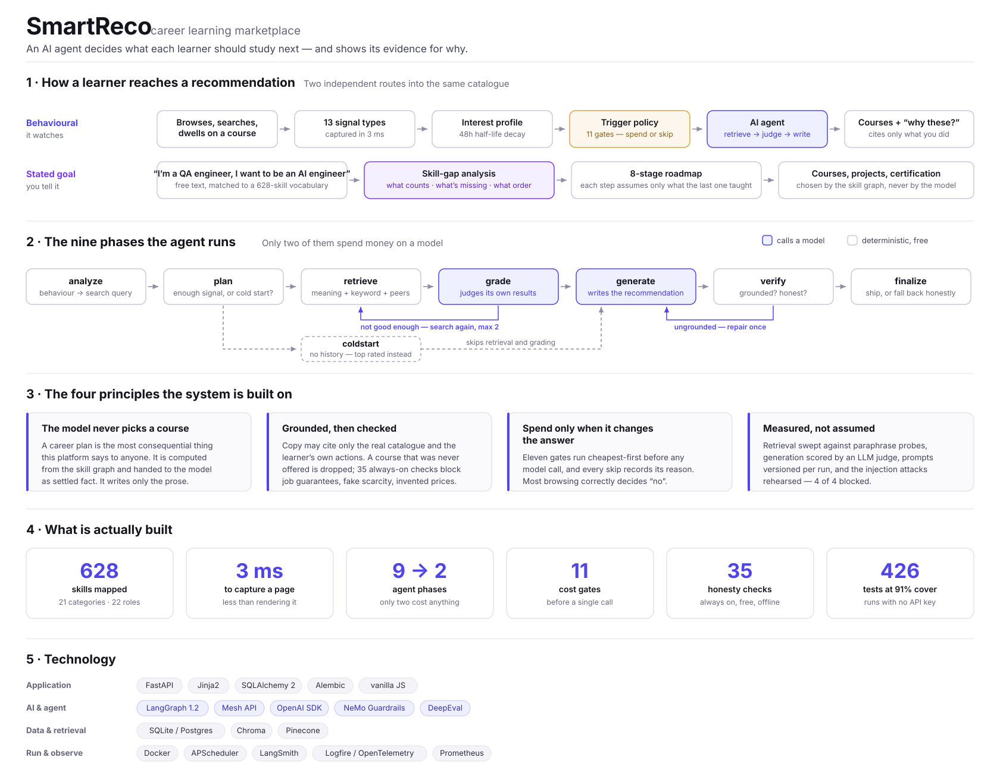
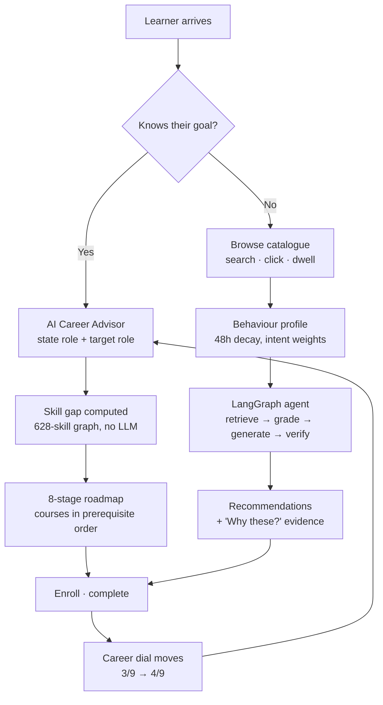
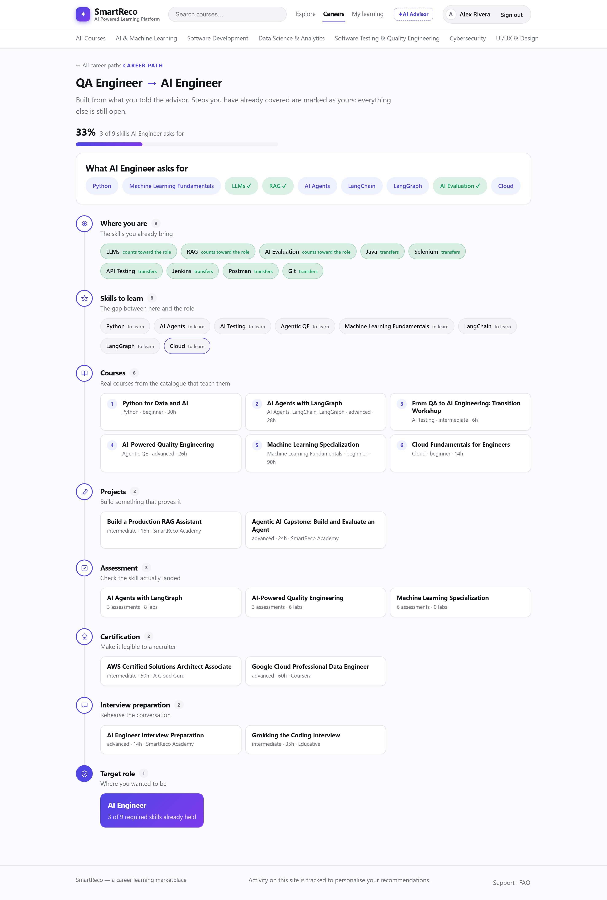
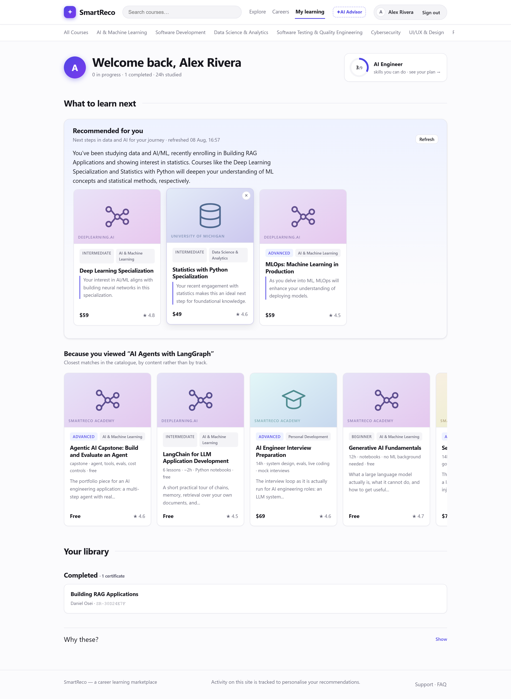

# SmartReco

**Any learning platform can show you a catalogue. SmartReco tells you which course is
next — and proves it didn't make it up.**

|  |  |
|---|---|
| **What** | A career learning marketplace over 66 real courses, with two AI engines under it |
| **For** | Learners who know they need to upskill, but not in what order |
| **Different** | In the career engine the model **never picks a course** — plans are computed from a 628-skill graph. A ten-year QA engineer is never told to learn testing |
| **Proof** | 4/4 prompt-injection attacks blocked · only 2 of the agent's 9 nodes spend tokens · 437 tests, 92% coverage · runs fully offline with no API key |



## How a learner uses it



Two entry paths, one catalogue. They converge: completing a course moves the career dial,
which feeds the next plan.

## What makes it different

**The model does not choose the courses.** In the career engine the plan comes from a
skill graph and is handed to the model as settled fact — it writes only the paragraph
around it. A template fallback produces the same plan with `LLM_ENABLED=false`. "Which
course teaches RAG, and what must you know first" is answerable from data; a career plan
is the most consequential thing this platform says to anyone.

**Three ranking rules, each earned by a specifically bad plan it prevents.** Skills imply
skills (a ten-year tester is not told to learn testing). Seniority is per-skill (fifteen
years of QA does not skip the intro to machine learning). Interview-prep courses never
teach a gap (they list Python because their problems are written in it).

**Copy that is persuasive *and* checkable.** The agent cites only concrete facts about
what the learner actually did — shown to them as "Why these?". 35 deterministic checks
block job guarantees, invented statistics, fake scarcity and prices not in the catalogue.
A groundedness verifier drops any course that was never offered to it.

**Spending is deliberate.** An 11-gate trigger policy decides whether a model call is
worth making *before* the agent runs, and every skip records its reason — cache hit,
interests unchanged, cooldown, warming up — visible live in `/admin`. Only 2 of the
agent's 9 nodes spend tokens at all.

## What it looks like

Captured from a running instance by [`scripts/screenshots.py`](scripts/screenshots.py).

**The roadmap is the whole argument in one screen** — a QA engineer of ten years moving
into AI engineering. *Selenium*, *API Testing* and *Java* are marked **transferring**, and
*Testing* is **absent from the gap list**. Then six courses in an order where each only
assumes what the one before it taught. Nothing here was chosen by a language model.



**One personal page** — the agent's picks with a reason on each card, and a career dial
reading **3/9**, which moves when a course is *completed*, because that is the one claim
here we can verify.



**Operations** — SQL↔vector sync health, the trigger policy's skip reasons with a live
"avoided" ratio, and the agent graph **read from the compiled LangGraph object** so it
cannot drift from what runs. Those `retrieve→grade→refine→retrieve→grade→…` rows are real
refine loops.


**Per-learner audit** — everything captured, the profile inferred from it, the exact facts
the model was given, and each recommendation with its reason. "Why was I shown that?" is
answerable without opening the database.

More: [the home page](docs/screenshots/home.png) ·
[the advisor](docs/screenshots/career-advisor.png) ·
[a course page](docs/screenshots/course-detail.png) ·
[the marketplace](docs/screenshots/marketplace.png) ·
[the taxonomy](docs/screenshots/explore.png)

## Key numbers

| | |
|---|---|
| Catalogue | 66 courses · 21 categories · 628 skills · 22 roles · 10 career paths |
| Agent | 9 LangGraph nodes, **2 spend tokens** · 6 conditional edges · bounded refine + repair loops |
| Retrieval | vector ⊕ BM25 → RRF → MMR → LLM re-rank — **recall@1 0.95 · recall@5 1.00 · MRR 0.975** |
| Safety | 35 deterministic checks · groundedness verifier · **4/4 injection probes blocked** |
| Cost | 11 trigger gates · daily budget · circuit breaker · every skip records **why**, shown live in `/admin` |
| Ingest | 202 accepted in **3.0 ms p50** for a page's worth of events |
| Quality | **437 tests · 92% coverage** · hermetic, offline, no API key |

## Quickstart

```bash
git clone <your-fork> && cd SmartReco
cp .env.example .env          # add your MESHAPI_API_KEY (starts with rsk_)
uv sync --all-extras
uv run python -m app.seed
uv run uvicorn app.main:app --reload --port 8000    # http://localhost:8000
```

| Sign in as | Email | Password |
|---|---|---|
| admin | `admin@smartreco.dev` | `admin12345` |
| learner | `learner@smartreco.dev` | `learner12345` |

**It also runs with no API key at all.** Set `LLM_ENABLED=false` and the app uses a
deterministic embedder and template copy — every feature works, nothing is mocked out, and
it spends nothing. That is the mode the whole test suite runs in.

### See it work

1. Open **`/career`**, load the QA → AI Engineer example, and read the first two stages.
2. Browse a few machine-learning courses, search, sit on a course page for a minute.
3. Open **`/me`** — the agent reads that behaviour and writes a recommendation. Expand
   **"Why these?"** for the only facts it was allowed to cite.
4. Click **"Not interested"** on a card — it never comes back, including via cold start.
5. Open **`/admin`** — sync health, LLM calls avoided and why, the compiled graph, and
   every run's node path, tokens, cost and latency.

The catalogue is 66 real courses — Andrew Ng's specialisations, Karpathy's Zero to Hero,
OSCP — deliberately recognisable, so you can judge a recommendation for yourself. Seeding
also generates 24 synthetic learners so the collaborative-filtering leg has real
cross-user signal from a fresh clone.

## Architecture

```
┌──────────────── BROWSER ─────────────────────────────────────────────────────┐
│ Jinja2 pages · tracker.js → throttle → batch(20 | 5s) → sendBeacon ──┐       │
└──────────────────────────────────────────────────────────────────────┼───────┘
                                                          202 in ~3ms  │
┌──────────────────────── FastAPI ─────────────────────────────────────▼───────┐
│  ┌── INGEST ─────────┐   ┌── TRIGGER POLICY ────┐   ┌── AGENT (LangGraph) ─┐ │
│  │ bounded queue     │──▶│ enough events?       │──▶│ analyze → plan →     │ │
│  │ dedupe by idem key│   │ cooldown elapsed?    │   │ retrieve → grade →   │ │
│  │ chunked bulk write│   │ interests drifted?   │   │  (refine ⟲ ≤2) →     │ │
│  └────────┬──────────┘   │ budget left?         │   │ generate → verify →  │ │
│           ▼              │ signature cached? ─skip│  │ finalize             │ │
│  ┌── PROFILE ────────┐   └──────────────────────┘   └──────┬───────────────┘ │
│  │ 48h half-life     │      ┌── RETRIEVAL ──────────────┐  │                 │
│  │ intent weighting  │─────▶│ vector kNN ⊕ BM25 ⊕ CF    │◀─┘                 │
│  │ interest centroid │      │ → RRF → filter → MMR      │                    │
│  └───────────────────┘      └───────────────────────────┘                    │
│  ┌── OUTBOX WORKER ──┐   ┌── APScheduler ────────────────────────────────┐   │
│  │ drain · backoff   │   │ 16:00 digest · 60s outbox · 1h reconcile      │   │
│  └────────┬──────────┘   └───────────────────────────────────────────────┘   │
└───────────┼──────────────────────┬────────────────┬──────────────┬───────────┘
            ▼                      ▼                ▼              ▼
     ┌─────────────┐      ┌──────────────┐   ┌────────────┐  ┌───────────┐
     │ SQLite / PG │      │   Mesh API   │   │  ChromaDB  │  │   SMTP    │
     │  14 tables  │      │ chat + embed │   │ / Pinecone │  │ / file    │
     └─────────────┘      └──────────────┘   └────────────┘  └───────────┘
```

**Every model call leaves through `app/services/mesh.py`.** That single choke point is
what makes the budget cap, circuit breaker and token accounting real system properties
rather than per-call discipline someone has to remember.

Component detail in [`docs/architecture.md`](docs/architecture.md); the schema, dual-write,
event pipeline and agent nodes in [`docs/capabilities.md`](docs/capabilities.md).

## Beyond the basics

| Bonus | Status |
|---|---|
| ⭐ **Structured agent framework** | LangGraph 1.2, 9 nodes, conditional edges, bounded refine + repair loops. `/admin` renders the graph **read from the compiled object** |
| ⭐ **Scheduled proactive delivery** | APScheduler: digest at 16:00 UTC, outbox drain 60 s, reconcile hourly. Idempotent per `digest:<user>:<date>` |
| ⭐ **Observability** | **LangSmith** traces the graph, **Logfire** traces the request around it, joined through an OTel bridge. Both live, not just wired. Plus a durable `agent_runs` table |
| ⭐ **Retrieval polish** | Hybrid vector+BM25 → RRF → filters → MMR → LLM re-rank. Relevance floor **tuned by sweep, not guessed** |
| ➕ **Guardrails** | Deterministic rails always on, free and offline; NeMo Guardrails as an opt-in second layer |
| ➕ **Two vector backends** | Chroma locally, Pinecone deployed, behind one protocol. **Both verified against live indexes** |
| ➕ **Evals** | Retrieval recall@k + MRR; DeepEval faithfulness/relevancy plus a custom GEval rubric on real `generate()` output |
| ➕ **Red-teaming** | Prompt-injection probes against the live `generate → verify` path — **4/4 blocked** |
| ➕ **Prompt versioning** | Every run records which prompt version wrote it, visible in `/admin/agent-runs` |
| ➕ **Input-side PII scrubbing** | Search text is redacted before it reaches a prompt, not just checked on the way out |

## Testing

```bash
uv run pytest tests/ -q                       # 437 tests, offline, no API key, spends nothing
uv run pytest tests/ -q --cov=app             # coverage (92%)
uv run python scripts/eval_retrieval.py       # recall@k + MRR over 20 paraphrase probes
uv run python scripts/eval_generation.py      # DeepEval metrics + custom rubric (costs tokens)
uv run python scripts/red_team.py             # adversarial prompt-injection probes (costs tokens)
```

Several tests are explicitly labelled regressions for bugs found during the build — an
unpublished course staying recommendable, a search-only learner getting no interest
signal, error pages returning 200, and a digest reporting clean runs while delivering
nothing.

## Configuration

Everything is in `.env` (see `.env.example`). The knobs that matter most:

| Variable | Default | Effect |
|---|---|---|
| `LLM_ENABLED` | `true` | `false` runs the whole app offline for $0 |
| `LLM_DAILY_BUDGET_USD` | `1.00` | Hard spend cap across all callers |
| `REC_MIN_EVENTS` | `5` | Events before a recommendation is considered |
| `REC_COOLDOWN_SECONDS` | `90` | Floor between runs for one learner |
| `RETRIEVAL_SCORE_RATIO` | `0.55` | Relevance floor, relative to the best hit |
| `VECTOR_BACKEND` | `chroma` | `chroma` locally, `pinecone` when deployed |
| `LANGSMITH_TRACING` | `false` | `true` + an API key traces the graph |
| `LOGFIRE_ENABLED` | `false` | Needs `LOGFIRE_TOKEN` **or** `LOGFIRE_CONSOLE=true` |

## Deployment

```bash
docker compose up --build                      # SQLite on a volume
docker compose --profile postgres up --build   # Postgres instead
uv run alembic upgrade head                    # apply database migrations
```

Multi-stage image, non-root user, healthcheck, `data/` on a volume. CI runs lint, the
suite on Python 3.11 and 3.12 with an 80% coverage floor, a from-scratch migration check,
a seed-and-verify-sync check, and a container build that must report healthy.

A container's disk does not survive a restart, so `docker compose` sets
`VECTOR_BACKEND=pinecone`. Nothing above `vectorstore.py` knows which backend is live.

## Honest limitations

- **SES and SMTP have never touched their real service.** Both need a third-party account.
  Each is covered against a stub of the vendor's API — which pins the request shape and
  proves nothing about whether the vendor accepts it. Pinecone used to be on this list;
  running it live found **three bugs in under an hour** that sixteen stub tests had all
  agreed with. That story is in [`docs/design-decisions.md`](docs/design-decisions.md), and
  it is why this section exists.
- **APScheduler assumes one process.** The jobs are individually safe to run concurrently,
  so scaling out means changing the scheduler, not the jobs.
- **Skip counters are in-process** and reset on restart. The dashboard labels them "since
  this process started" and shows durable database totals separately.
- **The budget gate is checked before a call**, so one call can overshoot the cap. The
  guarantee is that spending *stops* once the limit is crossed, not that it never crosses.
- **Retrieval is tuned on 20 probes.** Those numbers would need re-establishing at real
  scale, where several near-identical deep-learning courses would compete rather than one.
- **Course names, providers and syllabus lines are real; prices and ratings are
  illustrative.** This is a demo platform, and no course listed here is affiliated with it.
- **Course artwork is generated, not licensed** — a track glyph on a hue derived from the
  slug: deterministic, zero third-party requests, CSP-safe.

## Documentation

| Doc | Covers |
|---|---|
| [`docs/architecture.md`](docs/architecture.md) | System components, why the two engines differ, the request path, short-term vs. long-term context |
| [`docs/capabilities.md`](docs/capabilities.md) | The schema, dual-write outbox, event pipeline, the agent's nine nodes, efficiency gates |
| [`docs/design-decisions.md`](docs/design-decisions.md) | Why it is built this way — model selection probe, retrieval floor sweep, RRF, guardrail reasoning, observability ordering |
| [`docs/low-level-design.md`](docs/low-level-design.md) | Module-by-module internals: reducers, branch conditions, decay math, Mesh's state machines, the skill-gap engine |
| [`docs/features.md`](docs/features.md) | One canonical feature inventory by audience |
| [`docs/evals.md`](docs/evals.md) | DeepEval, the GEval rubric, prompt versioning, PII scrubbing, red-teaming |
| [`docs/demo-script.md`](docs/demo-script.md) · [`docs/video-script-3min.md`](docs/video-script-3min.md) | Recording scripts for a walkthrough and a 3-minute product video |

Two presentation assets are derived from this README rather than maintained separately —
regenerate them when the numbers above change:
[`docs/smartreco-overview.svg`](docs/smartreco-overview.svg) and
[`docs/smartreco-onepager.pptx`](docs/smartreco-onepager.pptx).

## Stack

FastAPI · SQLAlchemy 2 · SQLite/Postgres · Alembic · **Mesh API** (all model traffic) ·
OpenAI SDK · LangGraph 1.2 · LangSmith · Logfire/OpenTelemetry · Chroma · Pinecone ·
NeMo Guardrails · DeepEval · APScheduler · Jinja2 · vanilla JS · uv · pytest · ruff · Docker

Code style follows [Andrej Karpathy's engineering philosophy](.claude/skills/karpathy-coding-style/SKILL.md);
see [AGENTS.md](AGENTS.md).
